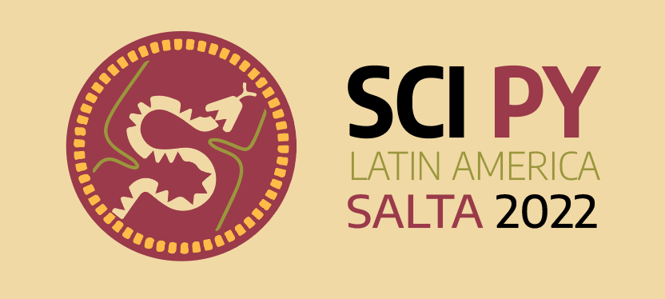

# Material_Taller_SciPy_2022_UNSa

Este es un Repositorio creado para poder compartir material desde el taller de Instalacion de TLJH en un VPS

# Desafio para el Taller de Scipy 2022 UNSA

Aquí tienes un sencillo rompecabezas para que entres en calor.

Santa está tratando de entregar regalos en un gran edificio de apartamentos, pero no puede encontrar el piso correcto; las instrucciones que obtuvo son un poco confusas. Comienza en la planta baja (piso 0) y luego sigue las instrucciones un carácter a la vez.

Un paréntesis de apertura,`(`, significa que debe subir un piso, y un paréntesis de cierre, `)`, significa que debe bajar un piso.

El edificio de apartamentos es muy alto y el sótano es muy profundo; nunca encontrará los pisos superior o inferior.

Por ejemplo:

`(())` y `() ()` ambos dan como resultado el piso 0.

`(((` y `(() (() (` ambos resultan en el piso 3.

`)) ((((((` también resulta en el piso 3.

`())` y `)) (` ambos resultan en el piso -1 (el primer nivel del sótano).

`)))` y `) ()) ())` ambos dan como resultado el piso -3.

¿A qué piso llevan las instrucciones a Santa?

## Encontraras un jupyter notebook con la consigna para poder resolver el Desafio

### Muchas Gracias a todos por su participacion y espero encontrarlos pronto para continuar aprendiendo sobre Python Cientifico.
